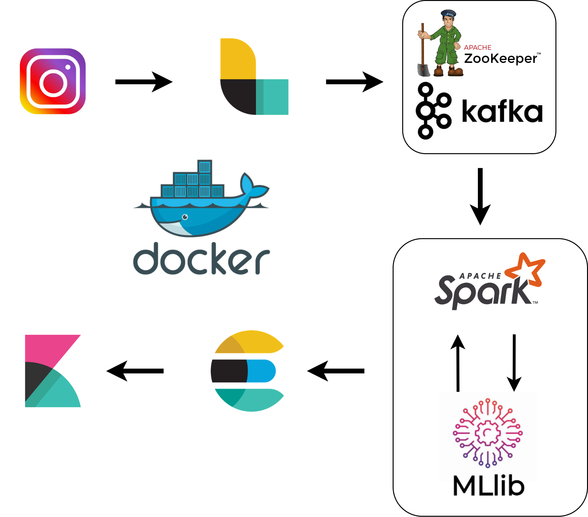

# InsTAP

## Purpose of the project

The purpose of the project is to carry out a sentiment analysis on the comments posted by Instagram users in order to evaluate which famous people are more or less loved by the Internet.


## Data Pipeline 

<p align="center"></p>

The components of the pipeline are listed below:

- **Instap Producer**: retrieves data from Instagram using the [Instaloader package](https://github.com/instaloader/instaloader) and sends it to **Logstash**

- **[Logstash](https://www.elastic.co/logstash)**: receives the data from the producer and writes on Kafka's Instap topic.
- **[Kafka](https://kafka.apache.org/)**: message broker, connects logstash to the Spark processing component.
- **[Spark](https://spark.apache.org/)**: received data from Kafka and perform machine learning prediction
- **[Elasticsearch](https://www.elastic.co/)**: Indexing incoming data.
- **[Kibana](https://www.elastic.co/kibana)**: UI dedicated to Data Visualization.


More technical details in the specific folder, more details on the actual usage in this project in **doc**.

## Requirements
- Docker (Desktop on Windows)
- Docker Compose
- Instagram Account credentials

## Usage

1.   Clone the project repository:

```
git clone https://github.com/rosarioamantia/insTAP
```

2. Move to producer folder and edit the producer.env file with your Instagram user credentials, users, number of posts and comments you want to see.

3. Download spark-3.1.2-bin-hadoop2.7 in spark/setup folder.

4. In the root repository (called insTAP) run all the docker containers:

```
docker-compose up
```
5. Now, the producer will generate data.
6. Go to:
```
localhost:5601
```

and import visualizations located in ```kibana/export.ndjson``` to ```Left Hambuger menu > Management > Stack Management > Saved Objects > Import```.
